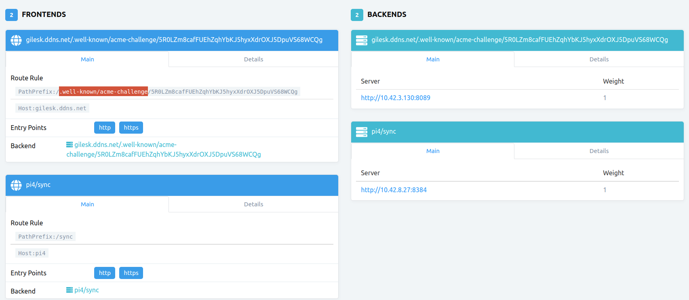

Intro (this is not working yet)
===============================

I'm working through using this post

- https://wildwolf.name/how-to-expose-kubernetes-dashboard-over-https/

but trying to use the built-in traefik instead of nginx.
I figure I'll learn more this way.

We already have instructions for installing Dashboard and creating a service
account admin-user in the root README
- https://github.com/gilesknap/k3s-minecraft.

This allows us to connect to the dashboard using a proxy.
```
kubectl proxy
```
connect to:
- http://localhost:8001/api/v1/namespaces/kubernetes-dashboard/services/https:kubernetes-dashboard:/proxy/#/login

Here we attempt to add an ingress so that you can directly connect over
HTTPS. This will include an auto-renewing TLS certificate since this is
needed to establish the secure HTTPS connection.

Install Cert Manager
====================

```
GITHUB_URL=https://github.com/jetstack/cert-manager/releases
VERSION_CERT_MANAGER=$(curl -w '%{url_effective}' -I -L -s -S ${GITHUB_URL}/latest -o /dev/null | sed -e 's|.*/||')
kubectl apply -f https://github.com/jetstack/cert-manager/releases/download/${VERSION_CERT_MANAGER}/cert-manager.yaml
```

Setup Certificate Issuer
========================
I used additional info from
- https://cert-manager.io/docs/configuration/acme/
for this, preferredChain is a recently added as a requirement.

```
kubectl apply -f - <<EOF
apiVersion: cert-manager.io/v1
kind: ClusterIssuer
metadata:
  name: clusterissuer-le
  namespace: kubernetes-dashboard
spec:
  acme:
    server: https://acme-v02.api.letsencrypt.org/directory
    preferredChain: "ISRG Root X1"
    email: gilesknap@gmail.com
    privateKeySecretRef:
      name: letsencrypt-prod
    solvers:
      - http01:
         ingress:
           class: traefik
EOF
```

Create a cert to manage access to the Dash
==========================================

```
kubectl apply -f - <<EOF
apiVersion: cert-manager.io/v1
kind: Certificate
metadata:
  name: kubernetes-dashboard
  namespace: kubernetes-dashboard
spec:
  secretName: certificate-prod-dashboard
  dnsNames:
    - gilesk.ddns.net
  issuerRef:
    name: clusterissuer-le
    kind: ClusterIssuer
EOF
```

You can monitor the progress of the certificate creation using this command

```
kubectl -n kubernetes-dashboard describe certificate kubernetes-dashboard
```

It seems that it may take a little while for the request to be honoured.

Setup the Ingress
=================

These were useful in working this out:
- https://cert-manager.io/docs/usage/ingress/#supported-annotations

```
kubectl apply -f - <<EOF
apiVersion: networking.k8s.io/v1
kind: Ingress
metadata:
  name: kubernetes-dashboard
  namespace: kubernetes-dashboard
  labels:
    k8s-app: kubernetes-dashboard
  annotations:
    kubernetes.io/ingress.class: traefik
    cert-manager.io/issuer: clusterissuer-le
spec:
  ingressClassName: traefik
  tls:
    - hosts:
        - gilesk.ddns.net
      secretName: certificate-prod-dashboard
  rules:
    - host: gilesk.ddns.net
      http:
        paths:
          - pathType: Prefix
            path: /
            backend:
              service:
                name: kubernetes-dashboard
                port:
                  number: 443
EOF
```

The Problem
===========

I'm finding that there is no secret certificate-prod-dashboard being created.

It looks like there is a whole host of complexity here, maybe the cert gets
created on the fly when the https handshake happens. This would need the
correct wiring between traefik and the ingress and also traefik would need
to support this and be configured for it as implied here https://traefik.io/blog/traefik-2-tls-101-23b4fbee81f1/

When I describe the certificate I see:

```
Events:
  Type    Reason     Age   From          Message
  ----    ------     ----  ----          -------
  Normal  Issuing    26m   cert-manager  Issuing certificate as Secret does not exist
  Normal  Generated  26m   cert-manager  Stored new private key in temporary Secret resource "kubernetes-dashboard-nz4x5"
  Normal  Requested  26m   cert-manager  Created new CertificateRequest resource "kubernetes-dashboard-rbgsx"
```

At what point is the secret certificate-prod-dashboard supposed to get created?

In the logs for traefik I see:
```
{"level":"error","msg":"Error configuring TLS for ingress kubernetes-dashboard/kubernetes-dashboard: secret kubernetes-dashboard/certificate-prod-dashboard does not exist","time":"2021-07-25T07:57:13Z"}
```

Traefik dash looks like this


